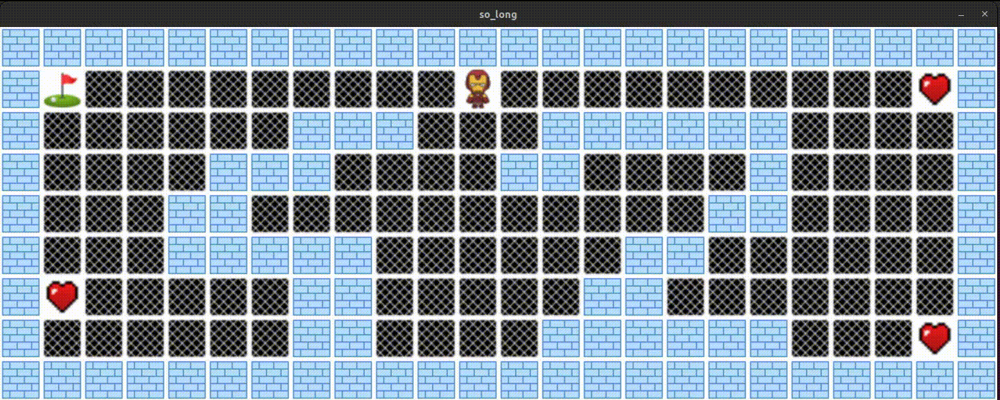

# so_long - A 2D Collectible Game

**So_long** is a simple 2D game where the player navigates through a map, collecting all available items (collectibles) before exiting. The game is designed using the **MLX graphics library** and allows the player to move across different maps while avoiding obstacles.

## Overview

In **so_long**, the player’s objective is to collect all items on the map and reach the exit to win the game. The game features different maps stored in a dedicated folder, and the game can be played with custom maps by passing them as arguments when running the program. The project was built using C and integrates graphical elements with the MLX library.

### Features

- **2D Map Navigation**: Players can move up, down, left, and right across a grid-based map.
- **Collectibles**: The goal is to collect all items scattered throughout the map.
- **Customizable Maps**: The game includes a folder of maps, and users can create or use custom maps.
- **MLX Integration**: Visuals are rendered using the MLX library for simple graphics and window handling.
- **Keyboard Controls**: Move the character using keyboard inputs (WASD or arrow keys).
- **Real-time Updates**: The game dynamically updates as the player moves and collects items.

## How to Use

### 1. Clone the Repository

First, clone the repository to your local machine:

```bash
git clone https://github.com/daniek1010/so_long.git
cd so_long
```

### 2. Build the Game

To compile the game, ensure you have the **MLX library** and other dependencies installed. Then, run the following command:

```bash
make
```

This will generate the executable `so_long`.

### 3. Prepare the Maps

The game comes with several predefined maps stored in the **`maps/`** directory. You can also create custom maps that follow the required format and save them in the `maps/` folder.

### 4. Running the Game

To run the game, pass a valid map file as an argument to the `so_long` executable:

```bash
./so_long maps/map1.ber
```

Replace `maps/map1.ber` with the path to any valid map file you want to play. The player can now use the keyboard to move around and collect all items before reaching the exit.

### 5. Game Controls

- **W && Up Arrow**: Move up
- **A && Left Arrow**: Move left
- **S && Down Arrow**: Move down
- **D && Right Arrow**: Move right
- **ESC**: Exit the game

## Map File Format

Maps are stored in `.ber` format and must follow a grid structure:
- **P**: Player starting position
- **C**: Collectible item
- **E**: Exit
- **1**: Wall
- **0**: Empty space

For example, here’s a simple 5x5 map:

```
11111
1P0C1
10001
1C0E1
11111
```
## So_long Demo



## Contributing

Feel free to contribute by opening issues or submitting pull requests to improve the game’s functionality or add new features!
